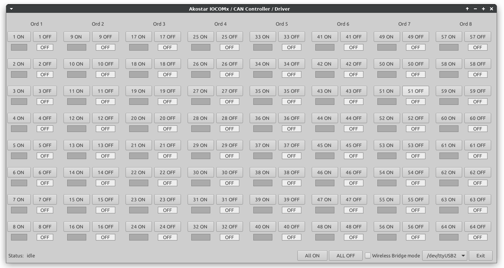

# IOCOM8-Support

###  Technical documentation for the IOCOM to IOCOM64

  This directory contains the IOCOM8 user / developer documentation.

  The ./docs directory contains the documentation in .odt format. The ./CAN directory contains
  sample applications demonstrating how to control the IOCOM from the CAN bus.

### Screen Shot of the control application

